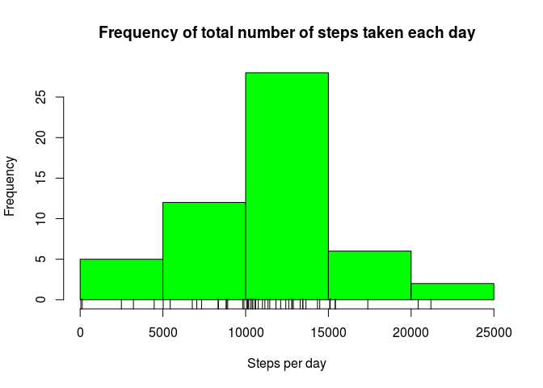
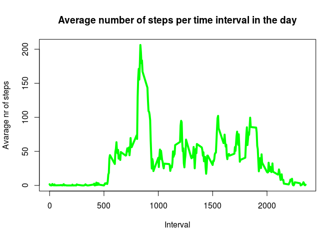
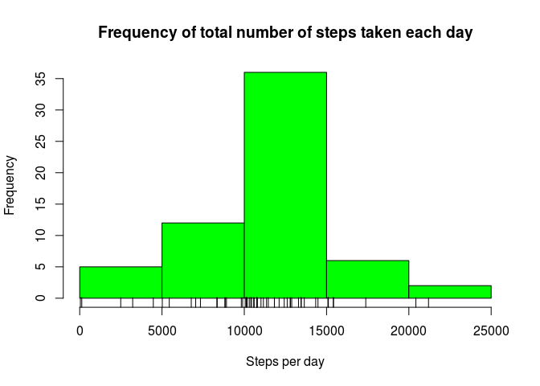
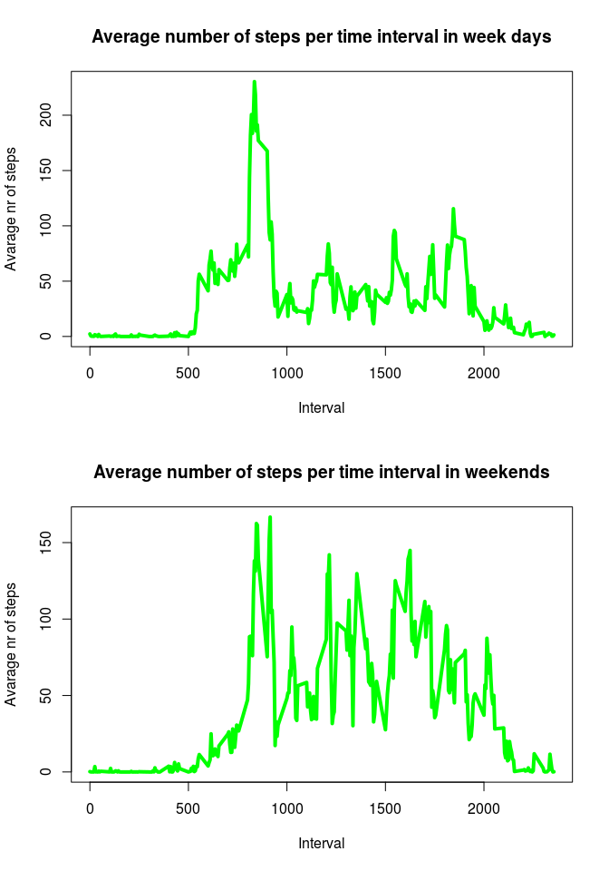

# Reproducible Research: Peer Assessment 1

## Introduction

(from the course web site introduction to the assignment)

This assignment makes use of data from a personal activity monitoring device. 
This device collects data at 5 minute intervals through out the day. 
The data consists of two months of data from an anonymous individual collected during the months of October and November, 2012 
and include the number of steps taken in 5 minute intervals each day.

The data for this assignment can be downloaded from the course web site:

[Activity monitoring data](https://d396qusza40orc.cloudfront.net/repdata%2Fdata%2Factivity.zip)

The variables included in this dataset are:

- steps: Number of steps taking in a 5-minute interval (missing values are coded as 𝙽𝙰)
- date: The date on which the measurement was taken in YYYY-MM-DD format
- interval: Identifier for the 5-minute interval in which measurement was taken

The dataset is stored in a comma-separated-value (CSV) file and there are a total of 17,568 observations in this dataset.


What follows assumes that the working directory contains that "activity.zip" provided in the above link.

## 1 - Loading and preprocessing the data


The first step is to load the data set:


```r
#unzip 
unzip("activity.zip")
#read the data
my_data<-read.csv("activity.csv")
```

Then we give a first look at it:

```r
str(my_data)
```

```
## 'data.frame':	17568 obs. of  3 variables:
##  $ steps   : int  NA NA NA NA NA NA NA NA NA NA ...
##  $ date    : Factor w/ 61 levels "2012-10-01","2012-10-02",..: 1 1 1 1 1 1 1 1 1 1 ...
##  $ interval: int  0 5 10 15 20 25 30 35 40 45 ...
```

It is a data set of 17568 observations and 3 variables.

The observations were collected along 61 days, from 2012-10-01 to 2012-11-30.
Each day is divided in 288 intervalls of 5 minuts each, labelled with a up to 4 cypher string where the first two slots are for hour and the last two for minutes (so that, for example, 2345 is 23:45, that is 11:45 pm).

We will deal with NAs later, but it will be useful to adjust the class of the second variable.


```r
my_data$date=as.Date(my_data$date)
```

## 2 - What is mean total number of steps taken per day?

As suggested in the assignment, for this first part we will ignore the missing values.

The *total number of steps taken per day* is given by


```r
my_data0<-na.omit(my_data)
s<-tapply(my_data0$steps, my_data0$date, sum)
s
```

```
## 2012-10-02 2012-10-03 2012-10-04 2012-10-05 2012-10-06 2012-10-07 
##        126      11352      12116      13294      15420      11015 
## 2012-10-09 2012-10-10 2012-10-11 2012-10-12 2012-10-13 2012-10-14 
##      12811       9900      10304      17382      12426      15098 
## 2012-10-15 2012-10-16 2012-10-17 2012-10-18 2012-10-19 2012-10-20 
##      10139      15084      13452      10056      11829      10395 
## 2012-10-21 2012-10-22 2012-10-23 2012-10-24 2012-10-25 2012-10-26 
##       8821      13460       8918       8355       2492       6778 
## 2012-10-27 2012-10-28 2012-10-29 2012-10-30 2012-10-31 2012-11-02 
##      10119      11458       5018       9819      15414      10600 
## 2012-11-03 2012-11-05 2012-11-06 2012-11-07 2012-11-08 2012-11-11 
##      10571      10439       8334      12883       3219      12608 
## 2012-11-12 2012-11-13 2012-11-15 2012-11-16 2012-11-17 2012-11-18 
##      10765       7336         41       5441      14339      15110 
## 2012-11-19 2012-11-20 2012-11-21 2012-11-22 2012-11-23 2012-11-24 
##       8841       4472      12787      20427      21194      14478 
## 2012-11-25 2012-11-26 2012-11-27 2012-11-28 2012-11-29 
##      11834      11162      13646      10183       7047
```

We can use this information to look at the histogram of the total number of steps taken each day


```r
hist(s, main = "Frequency of total number of steps taken each day", col="green", xlab = "Steps per day")
rug(s, ticksize = 0.04, lwd = 1)
```

<!-- -->

This tells us that, more often, the test subject performs between 10.000 and 15.000 steps per day.


Finally we can calculate *the mean and median of the total number of steps* taken per day

```r
mean(s, na.rm = TRUE)
```

```
## [1] 10766.19
```

```r
median(s, na.rm = TRUE)
```

```
## [1] 10765
```

## 3 - What is the average daily activity pattern?

There are 288 different labels for the intervals, each of them repeats once for each of the 61 days.

First we compute the mean of steps for all the intervalls of the same type, then we 
use this information to make a time series plot  of the 5-minute interval (x-axis) 
and the average number of steps taken, averaged across all days (y-axis):


```r
s_int<-tapply(my_data$steps, my_data$interval, mean, na.rm=TRUE)
plot(unique(my_data$interval), s_int, type = "l", col="green", lwd=4, xlab = "Interval", ylab = "Avarage nr of steps",
     main= "Average number of steps per time interval in the day")
```

<!-- -->

We can see a peak of activity between 8:00 and 10:00 am.


To understeand which 5-minute interval, on average across all the days in the dataset, contains the maximum number of steps, we run


```r
which(s_int==max(s_int))
```

```
## 835 
## 104
```

On averege, the peek of activity is in the intervall between 8:35 and 8:40 am.

## 4 -Imputing missing values

As noted in the first step, the data set contains several missing values.

If we run:


```r
my_data1<-my_data
sum(is.na(my_data1))
```

```
## [1] 2304
```

```r
sum(is.na(my_data1$steps))# - so na are all in the first variable
```

```
## [1] 2304
```

we see that all the missing values are in the first variable, and that 
the *total number of missing values* in the dataset (i.e. the total number of rows with NAs) is 2304.


Now we have to devise a *strategy for filling in all of the missing values* in the dataset. 

In section 3 we computed the mean number of steps for each kind of intervall.
We will use it to replace the missing values and create a new dataset that is equal to the original dataset but with the missing data filled in.


```r
for(i in 1:length(my_data1$steps)){
        if(is.na(my_data1$steps[i])==TRUE){
                int_temp<-my_data1$interval[i]
                temp<-subset(my_data1, my_data1$interval==int_temp)
                s_new<-mean(temp$steps, na.rm = TRUE)
                my_data1$steps[i]=s_new
        }
}
```

With this new data set we create an histogram of the total number of steps taken each day.


```r
#Calculate the total number of steps taken per day
s1<-tapply(my_data1$steps, my_data1$date, sum)

#Make a histogram 
hist(s1, main = "Frequency of total number of steps taken each day", col="green", xlab = "Steps per day")
rug(s1, ticksize = 0.04, lwd = 1)
```

<!-- -->


The* mean and median of the total number of steps taken per day* are given by:


```r
mean(s1)
```

```
## [1] 10766.19
```

```r
median(s1)
```

```
## [1] 10766.19
```

The resuts are not sensibly different from those in section 2.

## 5 Are there differences in activity patterns between weekdays and weekends?

For this final section we will use the dataset with the filled-in missing values.

First we create a new factor variable in the dataset with two levels – “weekday” and “weekend” indicating whether a given date is a weekday or weekend day.


```r
my_data3<-my_data1
#set local to US (to have defoult week days in English)
Sys.setlocale("LC_TIME", "en_US.UTF-8")
```

```
## [1] "en_US.UTF-8"
```

```r
#add variable weekday
my_data3$day<-weekdays(my_data3$date)
#add variable is weekend
for(i in 1:length(my_data3$day)){
        my_data3$weekend[i]<-my_data3$day[i] %in% c("Saturday", "Sunday")
}
```


With this final data set we can make a panel plot containing a time series plot of the 5-minute interval (x-axis) and 
the average number of steps taken, averaged across all weekday days or weekend days (y-axis). 


```r
#averaged across all week days:
data_wd<-subset(my_data3, my_data3$weekend==FALSE)
s_wd<-tapply(data_wd$steps, data_wd$interval, mean)

par(mfrow=c(2,1))
plot(unique(data_wd$interval), s_wd, type = "l", col="green", lwd=4, xlab = "Interval", ylab = "Avarage nr of steps",
     main= "Average number of steps per time interval in week days")

#averaged across all weekends:
data_we<-subset(my_data3, my_data3$weekend==TRUE)
s_we<-tapply(data_we$steps, data_we$interval, mean)

plot(unique(data_we$interval), s_we, type = "l", col="green", lwd=4, xlab = "Interval", ylab = "Avarage nr of steps",
     main= "Average number of steps per time interval in weekends")
```

<!-- -->


It seems like the test subject starts walking around later on the weekends, 
but walks more uniformly all afternoon, and until later in the evening.


